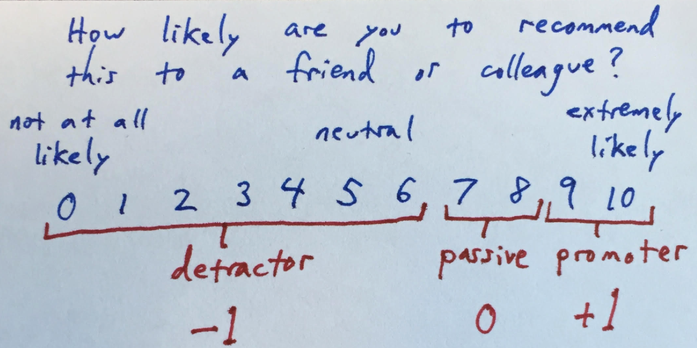
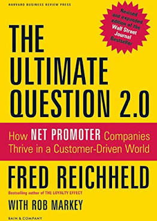

# The Ultimate Question 2.0, by Reichheld

I was interested in Net Promoter® score, so I read [the book][], which
is a longer version of [the original article][]. NPS is an interesting
case study in simplicity, interpretability, paths to action,
unintended consequences, and data collection.

[the book]: https://www.netpromotersystem.com/books/the-ultimate-question-2.0/ "The Ultimate Question 2.0"
[the original article]: https://hbr.org/2003/12/the-one-number-you-need-to-grow "The One Number You Need to Grow"

### Simplicity

Net Promoter is built around one question, now common in many
variants, about whether you'd make a recommendation.

The single-question approach may help with response rate, but that
isn't the only rationale.

> "Traditional satisfaction surveys ... ask too many questions and
> inspire analysis instead of action." (pages ix-x)

Reichheld describes research supporting the use of a single question
as a correlate of growth, and clustering analysis supporting the three
response categories. Whether these are perfect is beside the point of
_focusing_ on _some_ data about customer experience.

### Interpretability

The Net Promoter score is explained as the percentage of promoters
minus the percentage of detractors. This is equivalent to averaging a
remapping of the 0 to 10 scale, but better at maintaining a meaningful
interpretation.

> "[This] made sense to frontline managers, who could relate to the
> goal of increasing the number of promoters and reducing the number
> of detractors more readily than increasing the mean of their
> satisfaction index by one standard deviation." ([HBR][])

[HBR]: https://hbr.org/2003/12/the-one-number-you-need-to-grow "The One Number You Need to Grow"

This scoring method amounts to a kind of data visualization, focused
on communicating and understanding. Whether or not it generates the
best correlation coefficients with other quantities of interest,
there's little doubt that it's instantly understandable.

### Paths to Action

The Net Promoter _score_ is quantitative, but the _system_ is always
supposed to include a second question: "What is the primary reason for
your score?" This is one of the ways that NPS becomes actionable.

The open-ended follow-up avoids "the preconceived response categories
of traditional customer-satisfaction questionnaires" (page 5) and
invites the power of anecdote.

> "Reading a comment from a customer promoter or detractor has far
> more impact than looking at a statistic on a monthly report from
> headquarters." (page 186)

The bottom-up application of NPS is intended to be non-anonymous and
closed-loop: An employee might call detractors shortly after their
responses come in to apologize and try to address issues immediately.

This kind of feedback helps to "Make NPS a tool to help people succeed
(not just an evaluation metric)" (page 254) independent of statistics.
The scores themselves can also be used more directly, but not without
risk.

### Unintended Consequences

NPS generates scores can be compared, incentivized, and then gamed:
[Goodhart's law][].

[Goodhart's law]: https://en.wikipedia.org/wiki/Goodhart%27s_law

NPS can also be used to evaluate employee satisfaction: "employee Net
Promoter scores (eNPS)" (page 165). Like any data, it can be used for
questionable purposes.

> "When JetBlue first began its eNPS surveys, it discovered pockets of
> detractors. Upon deeper investigation, management learned that some
> of these unhappy employees were preparing a union-organizing
> campaign. Rapid intervention helped resolve the key issues before
> things reached that point." (page 168)

### Data Collection

It's hard to get people to fill out surveys in the age of survey
fatigue.

> "Customers already receive too many survey requests, and as NPS
> spreads, their tolerance will diminish." (page 238 of 2011 version
> of 2006 book)

Reichheld recommends using phone surveys over register receipt surveys
or email surveys.

> "Phone surveys may not be the right long-term solution for your
> firm, but beware of defaulting to the cheapest alternative." (page
> 237)

Even with the shortest possible surveys, people are just
[sick of them][], which is a challenge for getting good data.

[sick of them]: https://www.bloomberg.com/news/articles/2016-05-04/tasty-taco-helpful-hygienist-are-all-those-surveys-of-any-use "The Inventor of Customer Satisfaction Surveys Is Sick of Them, Too"

---

Reichheld is a consultant who focuses on customer loyalty. Cynically,
he wants to be known for "a full-fledged management system with an
ethos that rivals [Six Sigma][] in power" (front flap) and get his
metric on [balanced scorecards][]. Less cynically, he really wants
companies to treat everyone well and avoid "bad profits" created by
taking advantage of customers.

[Six Sigma]: https://en.wikipedia.org/wiki/Six_Sigma
[balanced scorecards]: https://en.wikipedia.org/wiki/Balanced_scorecard

---

Otherwise unrelated quote:

> "A bounced check cost [Charles Schwab Corporation] 82 cents, but the
> firm charged the client $40." (page 128)
