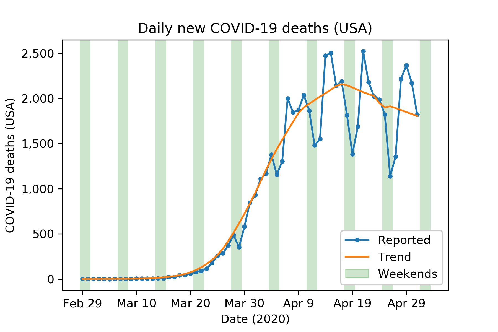
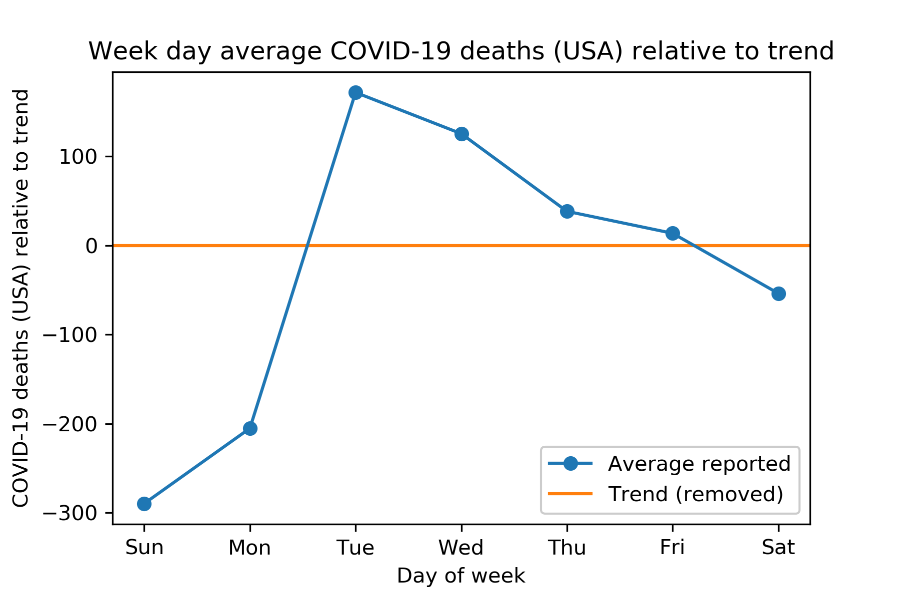

# Looks like people don't die on weekends

Like a lot of people, my hobby recently has been checking COVID-19
stats more often than is helpful. It can be hard to tell if a new
day's numbers are relatively good or bad, in part because of a
distinct weekly pattern.

If you take out the trend, it's clear that there are consistently
relatively fewer deaths reported on Sundays and Mondays. There's a
compensatory tendency for Tuesdays and Wednesdays to have higher
numbers of deaths reported.

This clearly shows that the way to fight COVID-19 is by instituting an
all-weekend policy.

But it really is an interesting phenomenon. What's causing this effect
in the data?

 * Do people really avoid death on weekends? I could imagine a small
   effect in that direction, but I wouldn't think it would be anything
   like this big.
 * Is it purely a reporting effect? Lots of health professionals are
   working weekends these days, I suspect, but maybe clerical staff or
   others in the reporting chain take consistent weekends? I suspect
   this is the main explanation.
 * Why is it primarily Sunday and Monday rather than Saturday and
   Sunday? Do the daily numbers correspond more accurately to the
   prior day?

In any event, it's a good idea to, for example, use a 7-day rolling
average (as [in the Financial Times][]) to avoid being mislead by this
weekly pattern.

[in the Financial Times]: https://www.ft.com/coronavirus-latest

---

I used the New York Times' [covid-19-data][]. My code is all up
[on GitHub][].

[covid-19-data]: https://github.com/nytimes/covid-19-data
[on GitHub]: https://github.com/ajschumacher/covid_weekend
