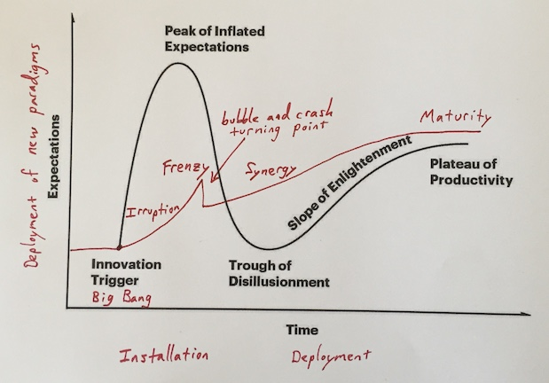

# Technological Revolutions and Financial Capital, by Perez

[Perez][] offers a [heterodox][] abduction from economic history, in
the tradition of [Schumpeter][] and [Kondratiev][], suggesting
[Technological Revolutions and Financial Capital][] dance through
"great surges" of 40 to 60 years, like giant [hype cycles][] driving
development.

[Perez]: https://en.wikipedia.org/wiki/Carlota_Perez
[heterodox]: https://en.wikipedia.org/wiki/The_Other_Canon_Foundation "The Other Canon"
[Schumpeter]: https://en.wikipedia.org/wiki/Joseph_Schumpeter
[Kondratiev]: https://en.wikipedia.org/wiki/Kondratiev_wave
[Technological Revolutions and Financial Capital]: https://en.wikipedia.org/wiki/Technological_Revolutions_and_Financial_Capital
[hype cycles]: https://en.wikipedia.org/wiki/Hype_cycle

(The hype cycle analogy isn't perfect; see [elsewhere][] for
summarization of Perez's formulation and five surges.)

[elsewhere]: https://en.wikipedia.org/wiki/Technological_Revolutions_and_Financial_Capital

Taking Dosi's extension of Kuhn's scientific paradigms to
[technological paradigms][] and further involving economics and
societal institutions (especially as capitalism vs. regulation), the
ideas are [not wholly original][], but neither are they very common.

[technological paradigms]: https://en.wikipedia.org/wiki/Technological_paradigm#Giovanni_Dosi
[not wholly original]: https://www.oxfordscholarship.com/view/10.1093/0199251053.001.0001/acprof-9780199251056 "As Time Goes By, Freeman and Louçã"

> "The justification for an exercise that claims to give order to the
> historical record at the expense of its infinite complexity and
> richness is its heuristic value." (page 161)

Perez doesn't seem happy that the historical approach
[fell out of favor][] in economics, and it's neat to see her analysis
cover hundreds of years. This is economic history that doesn't just
refer to [Bretton Woods][], but also the [Peterloo Massacre][],
[Corn Laws][], and [nabobs][], to sample a few references. You know
about [May 1968 in Europe][], right?

[fell out of favor]: https://en.wikipedia.org/wiki/Methodenstreit "Methodenstreit"
[Bretton Woods]: https://en.wikipedia.org/wiki/Bretton_Woods_system
[Peterloo Massacre]: https://en.wikipedia.org/wiki/Peterloo_Massacre
[Corn Laws]: https://en.wikipedia.org/wiki/Corn_Laws
[nabobs]: https://en.wikipedia.org/wiki/Nabob
[May 1968 in Europe]: https://en.wikipedia.org/wiki/May_68

> "The role of the economic historian, as Gay perceived it, was to
> study and comprehend these cycles and to suggest ways of restraining
> their excesses." (page 158, quoting Cruikshank, extended quote
> below)

This book is the closest thing I've seen to Asimov's
[psychohistory][], as in the [Foundation][] books. The time-scale
(around 50 years vs. thousands) and claimed predictive power (little
vs. godlike) are very different, but the ideas of anticipating
long-term shifts and being ready for them are analogous, and Perez
does discuss some psychosocial aspects, as in "ethical softening"
during parts of her surges.

[psychohistory]: https://en.wikipedia.org/wiki/Psychohistory_(fictional)
[Foundation]: /20200714-foundation_trilogy/

The book was published in 2002. It was a theory that fit the dot-com
crash. How has the theory fit since then? The financial industry was
not much reined in, for one.

> "However, this change in the rules of the game may not be easy,
> because the financial collapse has not been spectacular enough to
> wipe out the excess self-confidence." (page 168, on the dot-com
> crash)

Maybe the [Great Recession][] was just a late example of financial
adventurism. The theory suggests that shouldn't be happening so much
during the deployment phase of the age of information. It's easy to
feel like markets were _never_ really brought back in line with the
real economy. Have we been in a "gilded age"?

[Great Recession]: https://en.wikipedia.org/wiki/Great_Recession

It should be about time for the start of a new surge. What will the
next big technology be?

> "It has often been suggested that biotechnology, bioelectrics and
> nanotechnology might conform the next technological revolution."
> (page 13)

From where I sit, AI/ML seems like a good candidate. Should we throw
in VR/AR? Blockchain? Private space? Does the social web constitute a
separate technology?

The book's theory treats technologies as available resources just
waiting for capital to fund them into prominence. I think this may be
too much of a simplification. In particular, it's [pretty hard][] to
guess in advance which technologies will take off and which will
fizzle, and I don't think there's any guarantee that there will always
be a technology at hand substantial enough to power another surge.

[pretty hard]: https://www.linkedin.com/pulse/8-lessons-from-20-years-hype-cycles-michael-mullany/

Alternatively, what if an even longer phase is coming to an end? What
if [declines in productivity growth][] are a real indication of the
[sigmoid][] peak of the [Market Society][] overall, and extended
financial weirdness a sign of an impending larger transformation of
societal system?

[declines in productivity growth]: https://en.wikipedia.org/wiki/Productivity_paradox
[sigmoid]: https://en.wikipedia.org/wiki/Sigmoid_function
[Market Society]: https://en.wikipedia.org/wiki/The_Great_Transformation_(book) "The Great Transformation"

It certainly feels, in 2020, as if the world sits on a knife-edge,
with forces pulling in multiple directions. Hopefully history will
help us to create a worthy future.

---

> "... Schumpeter's own view that aggregate figures conceal more than
> they reveal." (page 61, refs Schumpeter (1939) Vol. 1, pp. 43-4, I
> checked the ref and it's correct, but unfortunately Schumpeter's
> language is not very quotable)

---

> "People living through the period of paradigm transition experience
> great uncertainty as to the 'right' price of things (including that
> of stocks, of course)." (page 62)

---

> "So again, and not surprisingly, nothing in the capitalist system is
> clear and simple." (page 67)

---

> "Schumpeter defined capitalism as 'that form of private property
> economy in which innovations are carried out by means of borrowed
> money'." (page 72, refs Schumpeter (1939) p. 223)

---

> "There is a certain amount of circularity in all these observations,
> because the phases have been dated taking the occurrence of crises
> into account." (page 79)

---

Interesting reference: [The End of Finance: Capital Market Inflation, Financial Derivatives and Pension Fund Capitalism](https://www.amazon.com/End-Finance-Inflation-Derivatives-Capitalism/dp/0415208815)

---

> "The full history of the readjustment of relative paper and real
> values at the beginning of the twenty-first century will only be
> appropriately judged with hindsight." (page 112)

---

> "As with many processes in capitalism, it is by taking a successful
> behavior to its extreme that it turns into failure." (page 115)

---

> "To begin with, knowledge, experience and information have become
> capital goods." (page 144)

---

> "Without recognizable labor unions, salaries would not have been
> enough to serve as solvent demand much beyond food and basics."
> (page 145)

---

Page 146 has an interesting meta-analysis of the field of economics
viewed through the lens of the book's theory.

---

> "Technology is the fuel of the capitalist engine." (page 155)

---

> "[E.F. Gay] developed a dynamic vision of economic history [as] a
> record of swings of the pendulum between periods when social
> controls dominated and periods dominated by the actions of
> aggressive individuals. The former periods were static,
> characterized by security and stability. The latter periods ushered
> in by the introduction of new tools, weapons or other forces, were
> controlled by the powerful individuals who introduced these forces.
> These dynamic periods ... were crucial to economic development ...
> The role of the economic historian, as Gay perceived it, was to
> study and comprehend these cycles and to suggest ways of restraining
> their excesses." (page 158, quoting Cruikshank, 1987, on the
> founding Dean of Harvard Business School)

---

> "The _Methodenstreit_ between the historical school and the
> neo-classicals, which in practice expelled the state, Society and
> the historical context from economic theory, occurred in the period
> of installation of the third surge, which in the periodization
> proposed here is parallel to the installation period of the fifth,
> when the monetarists defeated the Keynesians." (page 162)

---

> "The ultimate test of usefulness of a model such as the one
> presented here is in relation to policy making, be it in business,
> in social organizations or in government." (page 163)

---

> "Yet if this model is a reasonable approximation to the way the
> system works then it is wise to try to engage in the design of
> regulations and institutions so they will be ready and in the arena
> of debate when the moment comes for them to be accepted." (page 165)

---

> "A golden age of worldwide expansion is possible." (page 171)
