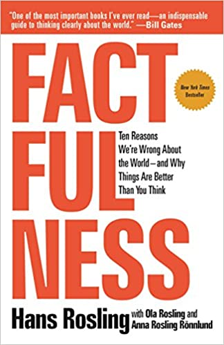

# Factfulness, by Rosling

[Factfulness][] finds [Rosling][] realizing that facts are not enough,
because thinking is polluted by "dramatic instincts," so his
presentation of little-known optimistic trends is organized to address
not just ignorance, but systematic biases in how people think.

[Factfulness]: https://www.gapminder.org/factfulness-book/
[Rosling]: https://en.wikipedia.org/wiki/Hans_Rosling

1. _The Gap Instinct_: Giving its name to his [foundation][], this is
   the tendency to think groups are completely different. Usually even
   if group averages are different, the distributions significantly
   overlap.
2. _The Negativity Instinct_: Bad news is reported and feels salient,
   even if trends are positive overall.
3. _The Straight Line Instinct_: Trends are not always linear, but
   it's easiest to extrapolate as if they were—and be wrong.
4. _The Fear Instinct_: Fear is often not calibrated to true risk.
5. _The Size Instinct_: Understanding "big" requires appropriate
   comparison.
6. _The Generalization Instinct_: Both categories and anecdotes can be
   misleading.
7. _The Destiny Instinct_: Slow change is not the same as no change.
8. _The Single Perspective Instinct_: Understanding requires more than
   one approach, view, or tool (even statistics).
9. _The Blame Instinct_: Whether effects are good or bad, the reasons
   are probably more complex than just one individual or organization.
10. _The Urgency Instinct_: It's better to think and act carefully
    than jump into drastic moves.

[foundation]: https://www.gapminder.org/

Rosling wants us to realize our shared humanity, see that things have
mostly gotten better over long time scales, and work to keep improving
things. The philanthropy of [Bill Gates][] is largely working to
continue the trends Rosling focuses on, for example.

[Bill Gates]: https://www.gatesnotes.com/books/factfulness

Like his classic [presentation][], celebrated by data visualizers, the
book is a study in good communication. I particularly noticed that he
often found opportunities to present dialogue rather than just
narrative, and that he used cute attention-getting flourishes like
using hypothetical "chimps" to stand in for random performance on his
quizzes.

[presentation]: https://www.youtube.com/watch?v=jbkSRLYSojo

I agree there's risk in assuming positive trends inevitably continue.
But it isn't fair to say Rosling ignored future risks. He listed five
things that he thought we _should_ worry about:

1. Global pandemic
2. Financial collapse
3. World War III
4. Climate change
5. Extreme poverty

Writing in 2017, he seems particularly prescient today.

---

> "... free access to data doesn't turn into knowledge without
> effort." (page 79)

---

> "It will be helpful to you if you always assume your categories are
> misleading." (page 158)
