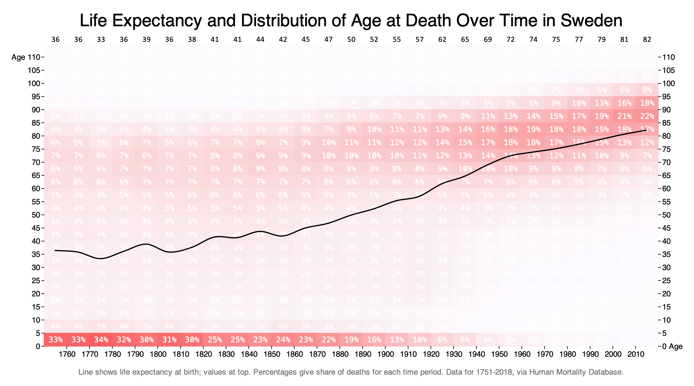

# Life expectancy is historically misleading

The modern distribution of age at death is substantially novel. In
today's wealthiest countries most people die at an age near their life
expectancy, but historically a third of people died as young children
and the remainder died over a wide range of ages.

[Life expectancy][] at birth, an average of possible ages at death, is
now a measure of central tendency, but even just 100 years ago the
distribution of age at death didn't really _have_ a central tendency.
Interpreting it as if it did gives a misleading impression of past
cultures.

[Life expectancy]: https://en.wikipedia.org/wiki/Life_expectancy

Inspired by [Hans Rosling][], I went looking for [life tables][].
Appropriately enough, his native Sweden birthed the first National
Statistical Office, with 270 years of life tables [available][].
That's enough history to show how the world used to be, and as a rich
country Sweden also shows us where the whole world is (hopefully)
heading.

[Hans Rosling]: /20200805-factfulness_by_rosling/
[life tables]: https://en.wikipedia.org/wiki/Life_table
[available]: https://www.mortality.org/cgi-bin/hmd/country.php?cntr=SWE&level=1

Back when life expectancy was mid-thirties, you were more likely to
die in your seventies than in your thirties. If you interpret a life
expectancy of 36 to mean "most people died around age 36" you might
incorrectly imagine a world with very few people over 50.

Or, as Rosling explains it:

> "Back in 1800, when Swedes starved to death and British children
> worked in coal mines, life expectancy was roughly 30 years
> everywhere in the world. That was what it had been throughout
> history. Among all babies who were ever born, roughly half died
> during their childhood. Most of the other half died between the ages
> of 50 and 70. So the average was around 30. It doesn't mean most
> people lived to be 30. It's just an average, and with averages we
> must always remember that there's a spread." ([Factfulness][], page
> 54)

[Factfulness]: /20200805-factfulness_by_rosling/

This doesn't mean that life expectancy isn't a useful statistic for
tracking development! It can be both limited and useful.

I like the visualization I made (above) because it shows enough
information to see distributional changes over time.

The question of whether life expectancy will _continue_ to go up is an
interesting one. I'm not sure this data has much to say. The length of
past lives has an [uncertain][] relationship with theoretical/possible
lifespan. Are people living longer, or just not dying earlier? There's
also a possible question about quality of life at extreme ages which
might be complicating.

[uncertain]: https://www.bbc.com/future/article/20181002-how-long-did-ancient-people-live-life-span-versus-longevity

---

Source for the visualization above is [on github][].

[on github]: https://github.com/ajschumacher/life_expectancy
