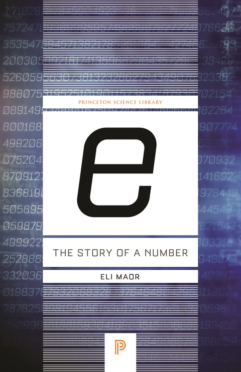
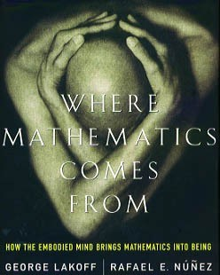

# _e_: The Story of a Number (and more)

[Eli Maor][] gives a great [history][] of [_e_][], full of
personalities and math concepts that I found very enjoyable. I was
reminded of the difference between historical development and modern
understanding, which led me to revisit
[Where Mathematics Comes From][], which has in its part VI perhaps a
better presentation of the latter way of knowing about _e_.

[Eli Maor]: https://en.wikipedia.org/wiki/Eli_Maor
[history]: https://press.princeton.edu/books/paperback/9780691168487/e-the-story-of-a-number
[_e_]: https://simple.wikipedia.org/wiki/E_(mathematical_constant)
[Where Mathematics Comes From]: https://en.wikipedia.org/wiki/Where_Mathematics_Comes_From

The historical perspective reminds me that math didn't start as formal
as it is now. Like [Bourbaki][] leading to [New Math][], modern
formalism may not be the best way to teach concepts. Being able to
prove something and understanding it are not the same thing. I'm not
sure I agree completely with the idea of what math is in [WMCF][], but
I do agree that humans do better when they understand things as
something more than just a game of symbol manipulation. In a similar
spirit to the [tau movement][], I think mathematical notation, proof,
and especially education should focus on communicating _meaning_.

[Bourbaki]: https://en.wikipedia.org/wiki/Nicolas_Bourbaki
[New Math]: https://en.wikipedia.org/wiki/New_Math
[WMCF]: https://en.wikipedia.org/wiki/Where_Mathematics_Comes_From
[tau movement]: https://tauday.com/tau-manifesto

More broadly, I think there ought to be [Feynman explanations][] for
more topics.

[Feynman explanations]: https://fs.blog/2012/04/feynman-technique/

 * [Is _e_ so "natural?"](#is_e_so_natural)
 * [A quick trip to \\( e^{\pi i} -1 = 0\\)](#a_quick_trip)
 * [A few quotes from _e_: The Story of a Number](#a_few_quotes)


---

### <a name="is_e_so_natural"></a>Is _e_ so "natural?"

I think _e_ is not always the best choice of base, despite being the
"natural" log base. The advantages of _e_ are largely to do with
calculus, and may not help in a particular application.

In the math for radioactive decay, often _e_ is used even though
things are mostly otherwise in terms of half-life. This [introduces][]
complexity that just isn't necessary. It would be more convenient to
use 1/2 as the base. (I wonder whether _e_ is used just because that's
the button people have on their calculators.)

[introduces]: https://www.khanacademy.org/science/physics/quantum-physics/in-in-nuclei/v/exponential-decay-formula-proof-can-skip-involves-calculus

In finance, interest is usually based on some finite period, like 1/12
of a year in the case of my savings account and mortgage. I did find,
[with help][], [one bank][] that compounds continuously for some
products. But usually \\( e^x \\) will be an approximation, not what
is really going on, for finance.

[with help]: https://twitter.com/planarrowspace/status/1293999229363458051
[one bank]: https://www.myfreeholdbank.com/savings.aspx

When scaling data with a log, changing the base is the same as
multiplying the scaled data by some constant. Especially if you're
already going to normalize that data (with a z-score, for example) or
use scale invariant techniques on the transformed data, it doesn't
matter what log base you use.

For [softmax][], we do care about the derivative, but not really about
whether it's _exactly_ equal to the function's value. When training a
neural net, the constant factor is "neutralized" by the constant
factor we introduce in the learning rate. At inference, using a
different base is the same thing as changing the softmax temperature,
which people already do for various reasons.

[softmax]: https://en.wikipedia.org/wiki/Softmax_function

The number \\( e \\) is very cool, no doubt, but that doesn't mean it
has to be used for every application.


---

### <a name="a_quick_trip"></a>A quick trip to \\( e^{\pi i} -1 = 0\\)

What function is always equal to its own derivative?

\\[ f(x) = f'(x) \tag{1} \\]

The constant function \\( f(x) = 0 \\) has that property, but is dull,
so leave it out.

The function can't ever touch the x-axis: the closer it gets, the
slower it approaches.

<!-- Then the function can't ever touch the x-axis, because of
something like Zeno's paradox." -->

The function can't be moved up or down, because that would break
equality with its derivative. It can be moved left or right, and it
can be flipped over the x-axis, so to pick a unique function, set the
y-intercept to be 1.

\\[ f(0) = 1 \tag{2} \\]

Equations (1) and (2) are enough to write out the function as a
polynomial.

Equation (2) says the constant term is 1. Equation (1) says the
polynomial must include a term whose derivative is 1, so the linear
term is \\( \int{1} = x \\). By the same reasoning, the next term is
\\( \int{x} = \frac{1}{2} x^2 \\), and the next is \\( \frac{1}{3}
\cdot \frac{1}{2} x^3 \\), and so on. This gives equation (3).

\\[ f(x) =
    1 + x + \frac{x^2}{2} + \frac{x^3}{3!} + \dots =
    \sum_{n=0}^{\infty} \frac{x^n}{n!}
    \tag{3} \\]

The functions with derivatives proportional to their values are the
exponential functions, \\( f(x) = b^x \\). Equation (2) is aligned
with \\( b^0 = 1 \\). Using \\( b^1 = b \\) identifies the base for
equation (3).

\\[ f(1) =
    \frac{1}{0!} + \frac{1}{1!} + \frac{1}{2!} + \frac{1}{3!} + \dots =
    2.718281828
    \tag{4} \\]

This is \\( e \\), and it's \\( e \\) not by numerical equality but
because this is the essence of \\( e \\): the base of the exponential
whose derivative equals its value.

\\[ e^x = \sum_{n=0}^{\infty} \frac{x^n}{n!} \tag{5} \\]

This relates exponentiation using arbitrary powers with using only
integer powers. It already supports complex exponents if you don't
mind doing some calculating.

```python
import math

def approx_exp(x, terms=20):
    return sum(x**n / math.factorial(n) for n in range(terms))

approx_exp(math.pi * 1j)
## (-1.0000000035290801-5.289182672965142e-10j)
```

\\[ e^{\pi i} + 1 = 0 \tag{6} \\]

To understand why that should be, consider that exponentiation
connects addition and multiplication, as \\( b^{m + n} = b^m \cdot b^n
\\). Imaginary numbers add as usual, but their multiplication amounts
to rotation. The base \\( e \\) has the property that rotation is
given in radians, so \\( \pi i \\) means one half turn, taking the
result to -1.

This can also be seen by discovering that \\( e^{xi} = \cos{x} + i
\sin{x} \\), for example by checking that their values at 0 and all
their derivatives are equal.

Negative bases have the funny property that their even exponents give
positive results, but odd exponents give negative results. What should
the result be for an exponent like 1.2, then? Thinking of rotation, it
makes sense that results sweep through complex values to get from the
positive real axis to the negative real axis and so on. This is a fine
way to draw a [logarithmic spiral][]. It can be connected to equation
(6).

[logarithmic spiral]: https://en.wikipedia.org/wiki/Logarithmic_spiral

\\[ (-b)^x = b^x (-1)^x = b^x (e^{\pi i})^x = b^x e^{x \pi i} \tag{7} \\]

The rotation comes from the negative base _already_ being rotated to
begin with. In fact it's only the boring positive real numbers that
don't rotate when exponentiated.

---

Forgive me for using \\( \pi \\) despite mentioning \\( \tau \\)
above; \\( \pi \\) is so familiar in this context that I didn't want
to introduce a separate new thing, even though \\( \tau \\) is
arguably better _especially_ in this setting.


---

### <a name="a_few_quotes"></a>A few quotes from _e_: The Story of a Number

> "Though [William] Oughtred held no official university position, his
> contributions to mathematics were substantial. In his most
> influential work, the _Clavis mathematicae_ (1631), a book on
> arithmetic and algebra, he introduced many new mathematical symbols,
> some of which are still in use today. (Among them is the symbol ×
> for multiplication, to which Leibniz later objected because of its
> similarity to the letter _x_; two other symbols that can still be
> seen occasionally are :: to denote a proportion and ~ for "the
> difference between.")" (page 15)

> "The Pythagoreans believed that numbers are the prime cause behind
> everything in the world, from the laws of musical harmony to the
> motion of the planets. "Number rules the universe" was their motto,
> and by "number" they meant natural numbers and their ratios;
> everything else—negative numbers, irrational numbers, and even
> zero—was excluded." (page 51)

> "[William Rowan] Hamilton's rigorous approach marked the beginning
> of axiomatic algebra: ..." (page 167)


---

Thanks to [Will Karnasiewicz][] for pointing me to a continuously
compounding bank, and Mervin Chen for pointing me to Khan's gratuitous
calculus.

[Will Karnasiewicz]: https://twitter.com/wmkarney


---




