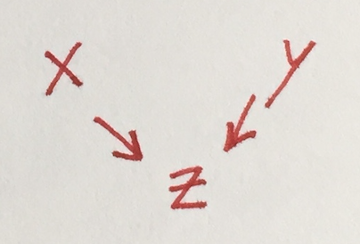

# What should be in your regression?

If you're fitting a model in the hopes of better understanding the
effect of _x_ on _y_, then including another predictor variable _z_
could be necessary, or could be harmful. Deciding whether to control
for _z_ depends on identifying how the variables are causally related.

 * [Simple direct causation](#direct)
 * [Mediated causation](#mediated): don't control for _z_
 * [Common cause (confounding)](#common_cause): control for _z_
 * [Common effect (collider)](#common_effect): don't control for _z_
 * [More complicated cases](#complicated)

These examples vary the data generating process (which isn't possible
in practice) in order to illustrate what happens in each case when you
do or don't control for _z_.

The [R][] code uses random [normal][] data, additive relationships,
and linear regression. With real data and processes, other modeling
methods may be more appropriate.

[R]: https://www.r-project.org/about.html
[normal]: https://en.wikipedia.org/wiki/Normal_distribution


---

### <a name="direct"></a>Simple direct causation


Say the reality is that _x_ influences _y_ (not the reverse) and no
other variables are involved.

<!-- set.seed(99) -->

```r
x = rnorm(100)
y = x + rnorm(100)
summary(lm(y ~ x))
##              Estimate Std. Error t value Pr(>|t|)
##  x            1.07747    0.11931   9.031 1.53e-14 ***
```

The estimate of 1.077 is close to the true value of 1. The very low
p-value (with three stars) indicates confidence that there is a
non-random relationship between _x_ and _y_.


---

### <a name="mediated"></a>Mediated causation: don't control for _z_


Here, the reality is that _x_ influences _z_, which then influences
_y_.

In this case, _x_ really does influence _y_, so you're right to look
for the relationship. And it might be tempting to control for _z_,
perhaps because of a desire to “isolate” the effect of _x_.

If you include _z_ in your regression, the desired estimate of the
effect of _x_ will disappear.

<!-- set.seed(101) -->

```r
x = rnorm(100)
z = x + rnorm(100)
y = z + rnorm(100)
summary(lm(y ~ x + z))
##               Estimate Std. Error t value Pr(>|t|)
##  x           -0.146874   0.135695  -1.082    0.282
##  z            1.127586   0.087819  12.840   <2e-16 ***
```

Including _z_ makes it appear that _x_ has no significant influence on
_y_, which is incorrect.

```r
summary(lm(y ~ x))
##              Estimate Std. Error t value Pr(>|t|)
##  x            1.11140    0.15343   7.244    1e-10 ***
```

Leaving _z_ out gives a good estimate of the effect of _x_.


---

### <a name="common_cause"></a>Common cause (confounding): control for _z_


In this case, the reality is that _z_ influences both _x_ and _y_,
which are otherwise unrelated.

This is an extreme example, in the sense that you'd be totally wrong
to look for an effect of _x_ on _y_ in this case. The case where
there's also a direct connection between _x_ and _y_ is similar, but
for simplicity this example doesn't have one.

If you don't include _z_ in your regression, the relationship between
_x_ and _y_ could be misleading.

<!-- set.seed(103) -->

```r
z = rnorm(100)
x = z + rnorm(100)
y = z + rnorm(100)
summary(lm(y ~ x))
##              Estimate Std. Error t value Pr(>|t|)
##  x            0.56257    0.10365   5.428 4.14e-07 ***
```

There is a relationship between _x_ and _y_, but it's because of _z_,
not because of _x_. The regression result ignoring _z_ could easily be
misinterpreted.

```r
summary(lm(y ~ x + z))
##             Estimate Std. Error t value Pr(>|t|)
## x            0.03608    0.10590   0.341    0.734
## z            1.05814    0.13556   7.806 6.93e-12 ***
```

With _z_ in the model, the result correctly indicates that _z_ is the
influencing factor.


---

### <a name="common_effect"></a>Common effect (collider): don't control for _z_



Here, the reality is that _x_ and _y_ are completely unrelated, but
they both influence _z_.

As with [common cause](#common_cause), it's more interesting when
there's also a direct connection between _x_ and _y_, but the behavior
is similar and this example keeps things simpler.

Somewhat surprisingly, if you include _z_ in your regression, you'll
see evidence that both _z_ and _x_ influence _y_.

<!-- set.seed(105) -->

```r
x = rnorm(100)
y = rnorm(100)
z = x + y + rnorm(100)
summary(lm(y ~ x + z))
##              Estimate Std. Error t value Pr(>|t|)
##  x           -0.46951    0.08831  -5.317 6.76e-07 ***
##  z            0.44439    0.04971   8.939 2.62e-14 ***
```

This is a case of “[explaining away][].”

[explaining away]: https://www.researchgate.net/publication/3192123_Explaining_explaining_away%27

```r
summary(lm(y ~ x))
##              Estimate Std. Error t value Pr(>|t|)
##  x           -0.11308    0.10586  -1.068    0.288
```

Without _z_ in the regression, the result correctly indicates no
relationship between _x_ and _y_.


---

### <a name="complicated"></a>More complicated cases

With a more complex causal graph, it may not be obvious what you need
to control for, or it may be that conventional methods of control
aren't sufficient. Methods like Judea Pearl's do-calculus might be
helpful.


---

Thanks to Erica Blom, Ben Klemens, and Jonathan Robinson for providing
helpful feedback.
