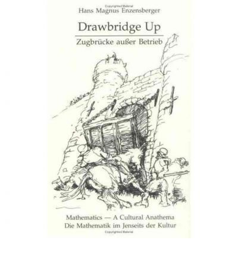

# Drawbridge Up, by Enzensberger

This [talk][] from [the author of The Number Devil][] is unfortunately
hard to find at a reasonable price. It's a beautiful short version of
the not uncommon sentiment that math should be more widely
appreciated.

[talk]: https://smile.amazon.com/Drawbridge-Up-Mathematics-Cultural-Anathema/dp/156881156X
[the author of The Number Devil]: https://en.wikipedia.org/wiki/Hans_Magnus_Enzensberger

 * Short: Drawbridge Up, by Enzensberger
 * Medium: [A Mathematician's Lament, by Lockhart](/20200909-mathematicians_lament_by_lockhart/)
 * Long: [How Not to Be Wrong, by Ellenberg](//20200925-how_not_to_be_wrong_by_ellenberg/)

At least [Mumford][]'s preface is [available][]:

[Mumford]: https://en.wikipedia.org/wiki/David_Mumford
[available]: https://www.dam.brown.edu/people/mumford/beyond/education.html

> "I am accustomed, as a professional mathematician, to living in a
> sort of vacuum, surrounded by people who, as in the first paragraph
> of Enzensberger's essay, declare with an odd sort of pride that they
> are mathematically illiterate. How astonishing to come to the
> International Congress and find a distinguished poet and essayist
> who analyzes this problem with such a deep understanding and
> sensitivity. This is a beautiful essay and great delight for a
> mathematician to read. Here the strange contradictions with which we
> live are laid bare with accuracy of a dissecting microscope. He is
> onto our schizophrenic world in which, with one hand, we take pride
> in building an elegant world utterly divorced from the demands of
> reality and, with the other, claim that our ideas underlie virtually
> all technological developments of significance. I was particularly
> pleased to find that he believes progress is possible in teaching
> mathematics, that it can be made exciting to young minds. I tried
> (unsuccessfully) to get each high school in which my children were
> enrolled to go outside during geometry class and find out how tall
> the oak in the yard really is. Instead they buckled under to the
> establishment and even removed that staple of my generation: the odd
> formulaic Euclidean-style proof in which the pedigree of each step
> was detailed. This old game, the one piece of high school
> mathematics often mentioned warmly by people who otherwise hated
> math, had been found wanting by the mathematical puritans described
> in the Stewart quote, where the mathematician is unwilling to "lie a
> bit, like everyone else does". I hope the right people read this
> essay -- the movers and shakers of school curricula -- and that it
> moves them to let a hundred flowers bloom in the classroom."

Let me know if you want to borrow my copy.

---

### Selected quotes

---

> "We know that ignorance is a cosmic force of truly insuperable
> power." (page 21)

---

> "The unforeseen utility of mathematical models is somewhat
> puzzling." (page 27)

---

> "The ancient debate among the Platonists, the Formalists and the
> Constructivists appears to be petering out into an exhausting
> stalemate. Mathematicians hardly concern themselves in their praxis
> with such questions." (page 29

---

> "It seems a pedagogical _idée fixe_ that children are incapable of
> abstract thinking." (page 37)

---

