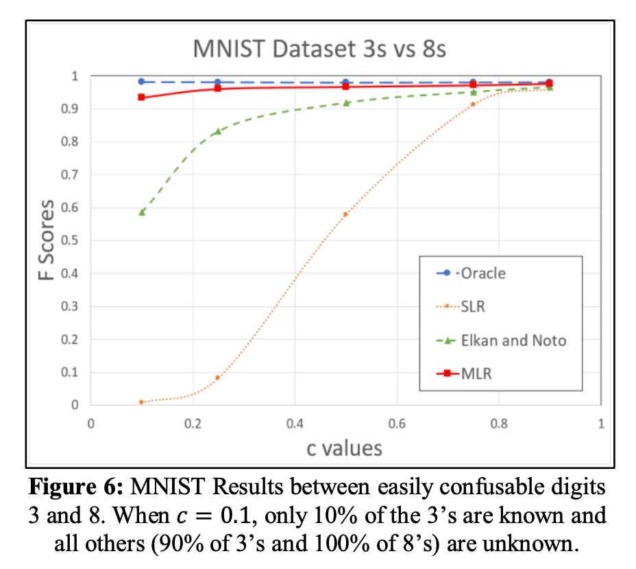

# Give the model epistemology

Jaskie has a nice paper with
[A Modified Logistic Regression for Positive and Unlabeled Learning][].
I like that it extends the usual logistic function in a way that
captures the idea that labels may be incorrect. I wonder about
extending the idea to multi-class softmax, and its relationship with
label smoothing.

[A Modified Logistic Regression for Positive and Unlabeled Learning]: https://ieeexplore.ieee.org/document/9048765

Here's the usual [logistic function][].

[logistic function]: https://en.wikipedia.org/wiki/Logistic_function

\\[ \frac{ 1 }{ 1 + e^{-x} } \tag{1} \\]

What Jaskie does is introduce another term in the denominator:

\\[ \frac{ 1 }{ 1 + b^2 + e^{-x} } \tag{2} \\]

The \\( b \\) term is squared to be non-negative, and learned during
model fitting. The effect is that the maximum score for a positive
example is less than one.

This makes sense in the positive unlabeled setting because Jaskie
differentiates between whether an example _is_ positive and whether an
example is _labeled_ positive. We only have the labels, and we know
that some positive examples may not be positively labeled, so the
probability based on the example that it is positively labeled is less
than one.

It's somewhat surprising that this seems to work quite well, as
demonstrated (for example) in Jaskie's Figure 6. (SLR is Standard
Logistic Regression, MLR is Jaskie's Modified Logistic Regression.)

Let's speculate about extending this idea to the multi-class setting.
First, just moving things around, Equation 2 becomes Equation 3.

\\[ \frac{ e^x }{ (1 + b^2) e^x + 1 } \tag{3} \\]

That form makes it easy to see the analogy between the usual logistic
function and the multi-class [softmax][]. Then the natural thing to
suggest is Equation 4.

[softmax]: https://en.wikipedia.org/wiki/Softmax_function

\\[ \frac{ e^{x_i} }{ \sum (1 + b_i^2) e^{x_i} } \tag{4} \\]

The semi-supervised setting in which there's a pile of unlabeled data
in addition to the labeled data is pretty common, especially when
labeling is expensive, and if something relatively simple like this
were to give similar performance benefits to Jaskie's binary case, it
could easily become very popular. (Assume you have a "garbage" class
as well, in the [open set][] sense.)

[open set]: https://paperswithcode.com/task/open-set-learning

There's probably a similar extension to keep the negative example
scores from going all the way to zero, if you think some of the true
negatives might have incorrectly positive labels (or otherwise wrong
labels in the multi-class setting).

I wonder about the relationship between these techniques and
[label smoothing][]... With smoothed labels you still have fixed (or
at least sort of balanced) target probabilities, whereas the above
techniques allow learning where the targets should be... But I think
you wouldn't get the limits on logit growth, with the above
techniques... It would be neat if the above techniques gave you good
calibration _and_ informative logits in the distillation sense. Hmm!

[label smoothing]: https://arxiv.org/abs/1906.02629
