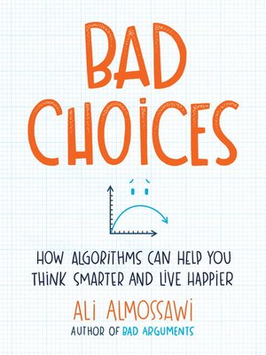

# Bad Choices, by Almossawi

I enjoyed Almossawi's illustrated introduction to computational
thinking, which is [freely available][] online. I've been [thinking][]
about non-fiction(ish) books for kids, and this one could be read by
middle-schoolers, I think, and possibly spark interest in learning
more. It illustrates the challenges and rewards of telling stories
about computer science topics.

[freely available]: https://bookofbadchoices.com/
[thinking]: https://github.com/ajschumacher/ajschumacher.github.io/issues/198

---

Almossawi has one of his distinctive [mind map][]s toward the end of
the book. Linearized, the topics in the book look something like this:

[mind map]: https://en.wikipedia.org/wiki/Mind_map

 * Fundamentals
     * Stacks
     * Arrays
     * Linked lists
     * Asymptotic notation
     * Worst, average cases
 * Searching
     * Binary search
     * Linear search
     * Hash tables
 * Sorting
     * Library sort
     * Priority queues
     * Mergesort
     * Quicksort
     * Insertion sort
 * Graphs
     * Maze-solving
     * Link analysis
 * Strings
     * Huffman coding

---

> "Note that all the lines in this book are plotted on a log-log
> scale, which is why the shapes of the lines are the way they are."
> (page xi)

I would have liked to see this better explained. The lines are never
labeled, and I'm not sure why this was intentional.

> "The lines in those graphs were intentionally unlabeled." (page 137)

Unless it was for this reason:

> "In my experience, any learning environment that encourages students
> to be fast learners is setting its students up for failure." (page
> xi)

That's interesting, but I'm not sure it's a good justification. At
least, I think it would be good to be explicit, like: "Add your own
labels to these," if that's what the reader is supposed to do.

---

> "If you look at human history, you're likely to find that many of
> the names you recognize belong to people who were educated as
> apprentices rather than as note takers." (page 3)

The "to learn more" section says this is from "Most Likely to Succeed:
Preparing Our Kids for the Innovation Era."

---

A glitch in the [Huffman coding][] example (starting page 69) is
corrected in the [errata][].

[Huffman coding]: https://en.wikipedia.org/wiki/Huffman_coding
[errata]: https://github.com/almossawi/badchoices/wiki/Errata

---

> "Interestingly, though, Morse determined the frequency of various
> letters not by talking to experts or conducting a study or analyzing
> data, but by counting the number of types in a printer's type box.
> So the next time a pedant questions your research methods, take
> heart." (page 72)

---

> "The _Wall Street Journal_ published an article recently about the
> rise of scrabble champions in Nigeria, and how their winning edge
> isn't necessarily due to a better vocabulary but rather to the
> counterintuitive tactic of opting for shorter words." (page 80)

The "to learn more" section references [For World’s Newest Scrabble Stars, SHORT Tops SHORTER](https://www.wsj.com/articles/for-nigerian-scrabble-stars-short-tops-shorter-1463669734).

---

> "We tend to interpret new information in a way that fits with what
> we already believe. It's what computer scientist Alan Kay calls
> relativizing." (page 84)

This seems sort of interesting, but I don't see a good reference for
it.

---

> "Douglas Carl Engelbart, inventor of the computer mouse, has written
> about the need to not only make the process of completing a set of
> tasks more efficient, but also the process of questioning whether
> the tasks are essential to begin with." (page 84)

I would love to find this writing!

---

> "We can't really explain a heap by analogy." (page 120)

---

> "When Feynman was once asked how he developed his legendary ability
> to solve problems so quickly, he said that it was because he modeled
> those problems in a multitude of ways, which is to say he looked at
> them from different perspectives." (page 125)

---

The "to learn more" section includes references to:

 * [The Man Who Tried to Redeem the World with Logic](http://nautil.us/issue/21/information/the-man-who-tried-to-redeem-the-world-with-logic)
 * [Computational Thinking](https://www.cs.cmu.edu/~15110-s13/Wing06-ct.pdf)

---

