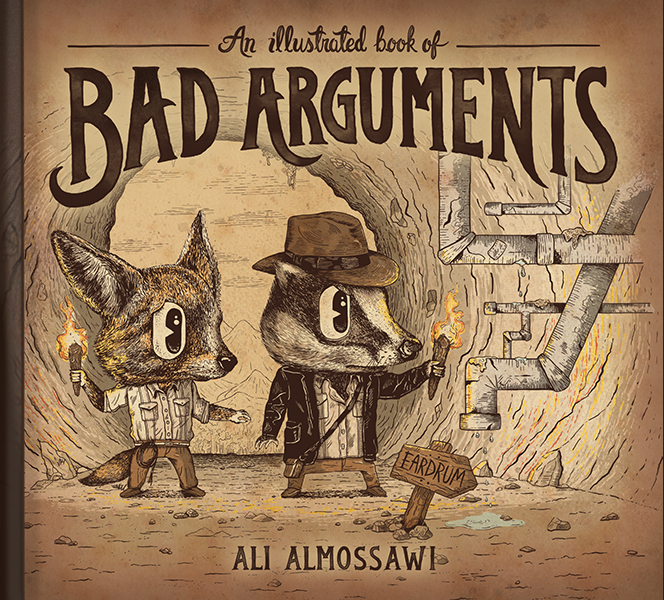

# Bad Arguments, by Almossawi

I wondered if there was a book of fallacies, and it turned out there
were several. Almossawi's is the cutest by far, and it's
[freely available][] online.

[freely available]: https://bookofbadarguments.com/

Thinking about fallacies is a fun way to think about how we reason,
and how we conceptualize things. There's no one correct taxonomy of
fallacies, and fallacies aren't always bad arguments. Books like this
are good for starting to access some of these ideas.

---

Almossawi has one of his distinctive [mind map][]s at the beginning of
the book. Linearized, the topics in the book look something like this:

[mind map]: https://en.wikipedia.org/wiki/Mind_map

 * Logical fallacies
     * Formal
         * Propositional
             * **Affirming the consequent**
     * Informal
         * Ambiguity
             * **Equivocation**
                 * Redefinition
                     * **No true Scotsman**
         * Causal
             * **Not a cause for a cause**
                 * **Slippery slope**
         * Unwarranted assumption
             * **False dilemma**
             * **Composition and division**
         * Begging the question
             * **Circular reasoning**
         * Weak analogy
             * Unrepresentative sample
                 * **Hasty generalization**
         * Missing data
             * **Appeal to ignorance**
         * Red herrings
             * **Argument from consequences**
             * **Guilt by association**
             * **Straw man**
             * **Appeal to the bandwagon**
             * Emotional appeal
                 * **Appeal to fear**
             * **Genetic fallacy**
                 * **Appeal to irrelevant authority**
                 * **Ad hominem**
                 * **Appeal to hypocrisy**

I think it's a good idea to organize ideas like this. It shows
clearly, for example, how many "different" fallacies are fundamentally
red herrings, according to the author. It also helps draw out that the
names of the fallacies aren't so important; in each case you could
just as well simply explain an argument's problem without using the
name.

It's fun to think about organizing these. Here's a different way I was
thinking about:

 * Problems with premises
     * **Circular reasoning** (A implies A is fine; the problem is
       starting with A.)
 * Arguing the wrong thing
     * Ambiguity
         * **Equivocation**
     * Redefinition
         * **No true Scotsman**
         * **Straw man**
     * **False dilemma**
 * Problems with form of argument (Non Sequitur)
     * **Affirming the consequent**
     * Weak analogy
         * Unrepresentative sample
             * **Hasty generalization**
     * Missing data
         * **Appeal to ignorance**
     * Causal
         * **Not a cause for a cause**
         * **Slippery slope** (This is sort of an odd one out; it's
           only a fallacy if it introduces some fallacious component,
           which could just as well be identified separately.
           [[discussion][]])
     * Unwarranted assumption
         * **Composition and division**
     * Distractions from topic
         * **Argument from consequences**
         * **Guilt by association**
         * **Appeal to the bandwagon**
         * Emotional appeal
             * **Appeal to fear**
         * **Genetic fallacy**
             * **Appeal to irrelevant authority**
             * **Ad hominem**
             * **Appeal to hypocrisy**

[discussion]: http://www.csun.edu/~dgw61315/fallacies.html#Slippery%20slope

I think red herrings are generally non sequiturs, but they may not
necessarily be fallacies, in a probabilistic sense. Heck, even the
most "logical" fallacy (affirming the consequent) can still count as
evidence for a proposition.

Almossawi does also note on page 40 (ad hominem) "That said, there are
situations where one may legitimately question a person's credibility,
such as during trial testimony."

---

> "The first principle is that you must not fool yourself and you are
> the easiest person to fool. - Richard P. Feynman"

---

On page 4, a reference to Gula's [Nonsense][], which might be a sort
of non-illustrated/longer version of Bad Arguments.

[Nonsense]: https://www.amazon.com/Nonsense-Herrings-Sacred-Everyday-Language/dp/1604191252/

> "That book reminded me of a list of guidelines that I had scribbled
> down in a notebook a decade ago about how to argue; they were the
> result of several years of arguing with strangers in online forums
> and they included, for example, "Try not to make general claims
> about things." That is obvious to me now, but to a schoolboy, it was
> an exciting revelation." (page 4)

---

> "One may reasonably appeal to _pertinent_ authority, as scientists
> and academics typically do. A vast majority of the things that we
> believe in, such as atoms and the solar system, are on reliable
> authority, as are all historical statements, to paraphrase C. S.
> Lewis."

[C. S. Lewis][] "was a British writer and lay theologian" - is
Almossawi paraphrasing him on the appeal to authority as a joke? Not
that the claim is wrong, just that it's a funny place to cite an
unrelated figure.

[C. S. Lewis]: https://en.wikipedia.org/wiki/C._S._Lewis

---

> "Inductive argument: An _argument_ in which if the _premisses_ are
> true, then it is probable that the conclusion will also be true."

This is what Pólya calls plausible reasoning, maybe to avoid the
confusion with mathematical induction or the specific/general
explanation (which I reject) for deductive/inductive reasoning.

I think [this][] claim: "Inductive reasoning is the opposite of
deductive reasoning." is not particularly helpful. (This site is heavy
on the "deduction is general to specific, induction is specific to
general".)

[this]: https://www.livescience.com/21569-deduction-vs-induction.html

This [other][] site has this example of induction: “John lives in
Chelsea” and “Most people living in Chelsea are rich” gives to “John
is rich.” This does not go from specific to general.

[other]: https://plato.stanford.edu/entries/abduction/#DedIndAbd

Plausible reasoning precedes logical reasoning (Almossawi quotes
Minsky: "Logic no more explains how we think than grammar explains how
we speak") and yet logical fallacies somewhat rudely direct us to
mistrust heuristics that are useful for plausible reasoning. This
relates to the idea of language being a model: the famous syllogism
takes "All men are mortal" as true, but really it's just highly
plausible. You really have to assume the premises.

In fact we could just as well speak of the Inductive Fallacy, and use
it to argue against all manner of things that are understood to be
true.

---

