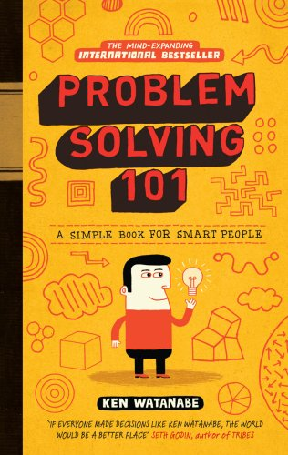

# Problem Solving 101, by Watanabe

This [book][] by a former [McKinsey][] consultant "started as a simple
guide to teach Japanese schoolchildren critical thinking skills." It's
a different perspective than the more math-focused
[How to Solve It][], for example, focusing on problems of everyday
life.

[book]: https://www.penguinrandomhouse.com/books/304164/problem-solving-101-by-ken-watanabe/
[McKinsey]: https://en.wikipedia.org/wiki/McKinsey_%26_Company
[How to Solve It]: https://en.wikipedia.org/wiki/How_to_Solve_It

### Watanabe's steps:

1. "understand the current situation"
2. "identify the root cause of the problem"
3. "develop an effective action plan"
4. "execute until the problem is solved, making modifications as necessary"

### Pólya's steps:

1. First, you have to understand the problem.
2. After understanding, make a plan.
3. Carry out the plan.
4. Look back on your work. How could it be better?

From these we learn that five steps is too many steps.

Watanabe emphasizes a number of visual aids:

 * "Logic tree" - break something down into sub-groups, exhaustively
 * "Yes/no tree" - a logic tree with yes/no logic, drawn as a
   flowchart
 * "Problem-solving design plan" - columns for Issue, Hypothesis,
   Rationale, Analysis/Activities, Information Source (mostly about
   understanding the problem)
 * "Hypothesis pyramid" - Boxes with arrows to show (possible)
   contributing factors for a conclusion, both for plausible reasoning
   and for deductive reasoning as appropriate
 * "Pros and cons; Criteria and evaluation" - Tables with various
   structure for pros and cons

A couple times he also uses quadrant charts where the axes are impact
and effort (for prioritizing). An interesting variation is that he has
his characters think about how to _change_ the required effort by
asking friends for help, etc.

---

### Selected quotes and (very rarely) comments

---

> "Being a problem solver isn't just an ability; it's a whole
> mind-set, one that drives people to bring out the best in themselves
> and to shape the world in a positive way." (page ix)

---

> "... approaches to broaden and organize one's thinking ..." (page x)

---

> "Problem solving isn't a talent limited to the lucky few. It's
> actually a skill and a habit that you can learn." (page 4)

---

> "People often fall into the trap of collecting information and
> conducting analyses just for the sake of doing them." (page 38)

---

> "If you start collecting and analyzing data without first clarifying
> the question you are trying to answer, you're probably doing
> yourself more harm than good." (page 39)

---

> "As Seneca said, "Luck is what happens when preparation meets
> opportunity."" (page 109)

That quote is [disputed][].

[disputed]: https://en.wikiquote.org/wiki/Seneca_the_Younger#Disputed

---

