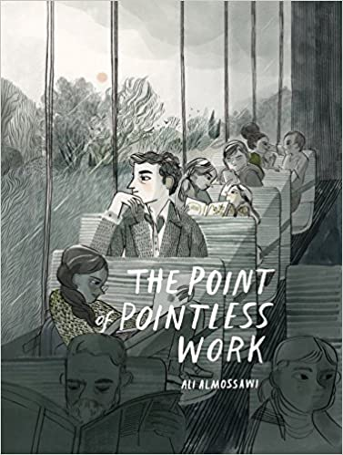

# The Point of Pointless Work, by Almossawi

The title's not quite right, but there's some on that. [It][]'s mostly
Almossawi's personal adventures in publishing: the stories of
[Bad Arguments][] and [Bad Choices][]. I enjoyed it.

[It]: https://almossawi.com/pointless-work/
[Bad Arguments]: /20201012-bad_arguments_by_almossawi/
[Bad Choices]: /20201011-bad_choices_by_almossawi/

I liked the detail about publishing, including buying a pack of ten
ISBNs, and agonizing about getting pallets of books from a ship and
into Amazon fulfillment centers.

I also think he's right that it's good for people to do things not
just out of economic necessity, and we're fortunate when we're able to
do so.

---

### Selected quotes and commentary

---

> "Anatol Rapoport has excellent advice about how to criticize. A
> critic, he says, ought to begin by stating the other side's position
> in a fair and objective way, then mentioning the areas of agreement,
> and only then mentioning the areas of disagreement. The approach
> does wonders when the goal is to turn something into a better
> version of itself rather than to posture." (page 42)

I also found more on this in a [post][] based on a book by Dennett
which is in my to-read pile.

[post]: http://www.rightattitudes.com/2017/06/16/rapoport-rules-criticism/

---

> "I was surprised to find that the copyeditors were all freelancers.
> ... When [prior employee copyeditors] retired, the publisher
> determined that it made economic and organizational sense to
> outsource that responsibility to freelancers." (page 74)

Yet another example of trying to get work done by contractors rather
than employees.

---

> "... Abraham Flexner's essay from almost a century ago on useless
> knowledge." (page 100)

This is [The Usefulness of Useless Knowledge](https://library.ias.edu/files/UsefulnessHarpers.pdf).

---

