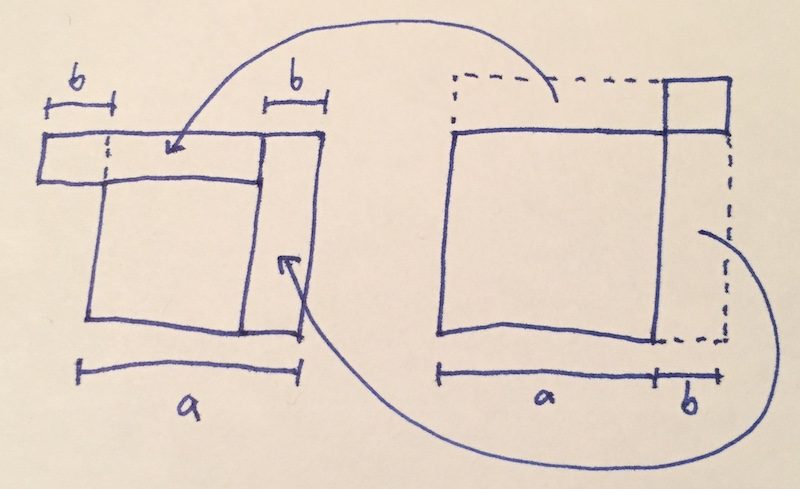

# The Variance Sum Law is Interesting

The [Variance Sum Law][] is simple enough that it's often given
without explanation, but I think it's interesting enough that it
deserves a little thought.

[Variance Sum Law]: http://onlinestatbook.com/2/glossary/variance_sum_law.html

The Variance Sum Law says that for two independent random variables
\\( A \\) and \\( B \\) with variances \\( \sigma_A^2 \\) and \\(
\sigma_B^2 \\), the sum \\( A+B \\) has variance \\( \sigma_{A+B}^2 =
\sigma_A^2 + \sigma_B^2 \\).

Explaining an application of this, you might consider an example: say
\\( a = 10 \\) and \\( b = 3 \\).

This kind of example is used in at least one course to introduce
[analysis of variance][]. After introducing the \\( 13 = 10 + 3 \\)
part, they continue:

[analysis of variance]: https://online.stat.psu.edu/stat501/lesson/2/2.5

> "Although the derivation isn't as simple as it seems, the
> decomposition holds for the sum of the squared distances, too."

It's possible to find a [derivation][], but they're generally not very
satisfying. And you know that the sum of squares is not the same as
the square of the sum: \\( 13^2 \neq 10^2 + 3^2 \\) because \\( 169
\neq 109\\). So what's going on?

[derivation]: http://web.pdx.edu/~joel8/resources/ConceptualPresentationResources/VarianceSumLaw.pdf

Using a single example helps explain what one element of data looks
like, but a single example doesn't have a variance.

We can make the example just slightly more complete to show how
variances add.

Say \\( A \\) is \\( +10 \\) half the time and \\( -10 \\) half the
time, while \\( B \\) is equally likely to be \\( +3 \\) or \\( -3
\\). So \\( \sigma_A^2 = 100 \\) and \\( \sigma_B^2 = 9 \\).

All our squares will be positive, so we can ignore negative outcomes
by symmetry here.

With that simplification, notice \\( A + B \\) is equally likely to be
\\( 10 - 3 = 7 \\) or \\( 10 + 3 = 13 \\).

\\[ \frac{(10-3)^2 + (10-3)^2}{2} = \frac{7^2 + 13^2}{2} = \frac{49 + 169}{2} = \frac{218}{2} = 109 = 100 + 9 = 10^2 + 3^2 \\]

The addition and subtraction cancel out after squaring so that the
variances add.

This property, that \\( (a+b)^2 + (a-b)^2 = 2(a^2 + b^2)\\), is what
makes variance decomposition work, for uncorrelated components.

It's simple algebra, but it's still kind of neat. Here's a geometric
illustration:

\\[ (a-b)^2 + (a+b)^2 = b^2 + a^2 + a^2 + b^2 \\]

Maybe this is completely intuitive for some people, but for me this
balancing of increased and decreased squares is something of a
pleasant surprise. Stop and smell the mathematical roses, you know?

There's [also][] a Pythagorean connection, which I think is neat, but
I haven't so far gotten it lined up with my intuition.

[also]: https://stats.stackexchange.com/a/420387/122282
