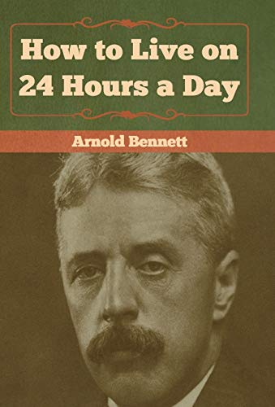

# How to Live on 24 Hours a Day, by Bennett

I've recommended this 1908 [book][] since [2010][]/[2011][], and I
thought I'd revisit it. The sexist language makes it hard to continue
recommending; I'd love to see a modern version.

[book]: https://en.wikipedia.org/wiki/How_to_Live_on_24_Hours_a_Day
[2010]: /2010/07/31/thoughts-on-tinkering-toward-utopia/
[2011]: /20160320-books_for_professionals/

The main message I take from this reading is the need to slow down,
when trying to do more. Reflect. Think. It's not packing as much as
possible into the time you have, it's getting as much as you can out.
As with eating, the good life isn't just quantity per time.

I relate aspects of this book to more recent [ideas][] about
[learning][] and memory, which I also think are good. Many of the
charming aspects of the book relate to the _why_ more than the _how_
of learning, and try to encourage the reader to believe that they
_can_ find the time to do more. (A modern version might reference
statistics on [screen-watching][], and find that people have a lot of
time that might be better spent.)

[ideas]: https://vasilishynkarenka.com/learning/
[learning]: https://www.coursera.org/learn/learning-how-to-learn
[screen-watching]: https://www.marketwatch.com/story/people-are-spending-most-of-their-waking-hours-staring-at-screens-2018-08-01

Taken mildly, Bennett's advice is to get a hobby, to develop an
interest, aligned with "cultivation of the mind." Taken more
seriously, he encourages more purposeful, joyful, and "examined" life.
I can get behind both sentiments.

---

> "The proper, wise balancing of one's whole life may depend upon the
> feasibility of a cup of tea at an unusual hour." (page 11)

---

> "We never shall have any more time. We have, and we have always had,
> all the time there is." (page 15)

---

> "... [Herbert Spencer][], in my opinion the greatest mind that ever
> lived, ..."

[Herbert Spencer]: https://en.wikipedia.org/wiki/Herbert_Spencer

Well that didn't age well...

---

> "The fact is that there is no easy way, no royal road." (page 21)

---

> "As I have previously said, the chief beauty about the constant
> supply of time is that you cannot waste it in advance." (page 22)

---

> "A glorious failure leads to nothing; a petty success may lead to a
> success that is not petty." (page 23)

---

> "But I do suggest that you might, for a commencement, employ an hour
> and a half every other evening in _some important and consecutive
> cultivation of the mind_." (page 31, emphasis added)

---

> "People complain of the lack of power to concentrate, not witting
> that they may acquire the power, if they choose." (page 37)

---

Bennett recommends:

 * [Marcus Aurelius](https://en.wikipedia.org/wiki/Marcus_Aurelius)
 * [Epictetus](https://en.wikipedia.org/wiki/Epictetus)
 * [Meredith](https://en.wikipedia.org/wiki/George_Meredith)
 * [Stephen Phillips](https://en.wikipedia.org/wiki/Stephen_Phillips)
 * [Wordsworth](https://en.wikipedia.org/wiki/William_Wordsworth)
 * [Tennyson](https://en.wikipedia.org/wiki/Alfred,_Lord_Tennyson)
 * [Tchaikovsky's 6th](https://en.wikipedia.org/wiki/Symphony_No._6_(Tchaikovsky))
 * [Lohengrin](https://en.wikipedia.org/wiki/Lohengrin_(opera))
 * [Krehbiel's How to Listen to Music](http://www.gutenberg.org/ebooks/17474)
 * [Witt's How to look at pictures](https://archive.org/details/cu31924008665071)
 * [Sturgis's How to judge architecture](http://www.gutenberg.org/ebooks/47937)
 * [Lombard Street](https://en.wikipedia.org/wiki/Lombard_Street:_A_Description_of_the_Money_Market)
 * [Paradise Lost](https://en.wikipedia.org/wiki/Paradise_Lost)
 * [On poetry in general](https://resources.saylor.org/wwwresources/archived/site/wp-content/uploads/2012/08/ENGL404-Hazlitt-On-Poetry-In-General.pdf)
 * [Aurora Leigh](https://en.wikipedia.org/wiki/Aurora_Leigh)
 * [The History of the Decline and Fall of the Roman Empire](https://en.wikipedia.org/wiki/The_History_of_the_Decline_and_Fall_of_the_Roman_Empire)
 * [First Principles](http://www.gutenberg.org/ebooks/55046)

---

> "Nothing in life is humdrum" (page 49)

---

> "One loses, in the study of cause and effect, that absurd air which
> so many people have of being always shocked and pained by the
> curiousness of life. Such people live amid human nature as if human
> nature were a foreign country full of awful foreign customs. But,
> having reached maturity, one ought surely to be ashamed of being a
> stranger in a strange land!" (page 49)

---

> "You would arrive at more difficult problems." (page 51)

---

> "coordinate the knowledge thus obtained and build a superstructure
> on it, and at last get to know something about something" (page 51)

---

> "Novels are excluded from "serious reading," ..." (page 53)

---

> "... bad novels ought not to be read, and that good novels never
> demand any appreciable mental application on the part of the
> reader." (page 53)

---

> "The great convenience of masterpieces is that they are so
> astonishingly lucid." (page 55)

---

> "There is much pleasure to be derived from being a specialist."
> (page 55)

---

> "The second suggestion is to think as well as to read. I know people
> who read and read, and for all the good it does them they might just
> as well cut bread-and-butter. They take to reading as better men
> take to drink. They fly through the shires of literature on a
> motor-car, their sole object being motion. They will tell you how
> many books they have read in a year." (page 55)

---

> "The gain in self-confidence of having accomplished a tiresome
> labour is immense." (page 59)
