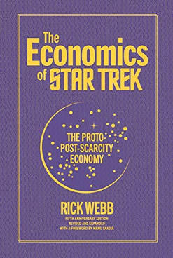

# The Economics of Star Trek, by Webb

I read the print version of the [blog post][], which delivers on the
fun of thinking about a world with the economics of the Star Trek
future. In the end you can't expect scifi to deliver economic
salvation, but imaginative inspiration is a fine starting point for
learning and thinking more.

[blog post]: https://medium.com/@RickWebb/the-economics-of-star-trek-29bab88d50

I didn't really find Webb's guesses to constitute a workable system,
though I can't really say whether the problem is his, Star Trek's, or
the failure of my imagination.

There's also an even more serious book on this topic: [Trekonomics][],
by Manu Saadia.

[Trekonomics]: https://en.wikipedia.org/wiki/Trekonomics

---

---

> "If you don't believe that nothing is forever, if you don't believe
> that society and humans can change, then you do not believe in the
> future (and, incidentally, you do not believe in the past either)."
> (page 11, in Manu Saadia's Foreward)

---

> "The one thing the show gets right is violence.
>
> "I would point to a recent book by Stanford historian Walter
> Scheidel: _The Great Leveler: Violence and The History of Inequality
> from the Stone Age to the Twenty First Century_ (Princeton
> University Press, 2017). Professor Scheidel's thesis is that
> throughout human history, only violence and war have truly managed
> to solve economic conflicts–and even more so when economic
> inequality got out of control, whether in pre-modern agrarian
> societies or during the turbulent and genocidal last century.
> Western Europe's prosperity rose out of the ashes and gas chambers
> of World War II. The war annihilated the old social hierarchies on
> the Continent, capitalists who happily collaborated with the Nazis
> were cast out of society and expropriated, thus removing the main
> opposition to expansive social safety net and to the modern welfare
> state. Former enemies began to cooperate and to coordinate, first
> economically and later politically. The European Union grew out of
> the War, it was a project borne out of the resistance to Nazism. The
> same is true of the post-war economic order (mostly, the
> Bretton-Woods accords shepherded by John Maynard Keynes) and of the
> United Nations. It is important to remember that all these were
> noble yet practical projects, conceived and imagined by idealists
> while the war was raging on and its outcome was still very much in
> the balance. If anything this proves that there is value in
> imagination and idealism, especially in times of great upheaval. One
> must always be ready." (pages 12-13, in Manu Saadia's Foreward)

This is a strange mix of dark and light...

(In Star Trek, many advances happened following
[The Eugenics Wars of the 1990s][].)

[The Eugenics Wars of the 1990s]: https://memory-alpha.fandom.com/wiki/Eugenics_Wars

Webb also opines on page 141 that "the sense lingers that if we _are_
to arrive at a Trek vision of the future, we might have to go through
our own version of The Eugenics Wars to get there."

---

> "The Federation seems a bit like Williamsburg–a lot of artists who
> don't need to work." (page 41)

---

Interesting bit on page 90 about a UBI study showing it increased
divorce rates (which people took as a bad thing, I think) but then
later it turned out the divorce result was a statistical error.

---

John Kenneth Galbraith's [The Affluent Society][] is referenced on
pages 134-135 as a text whose "arguments can be said to underpin [the]
Trek ideal."

[Social Limits to Growth]: https://en.wikipedia.org/wiki/Fred_Hirsch#Limits_to_Growth

Page 135 also references Fred Hirsch's [Social Limits to Growth][].

[The Affluent Society]: https://en.wikipedia.org/wiki/The_Affluent_Society

Page 141 references
[Inventing the Future: Postcapitalism and a World Without Work][] and
the [Mont Pelerin Society][] (though as "the Mount Perlan Society").

[Inventing the Future: Postcapitalism and a World Without Work]: https://en.wikipedia.org/wiki/Inventing_the_Future:_Postcapitalism_and_a_World_Without_Work
[Mont Pelerin Society]: https://en.wikipedia.org/wiki/Mont_Pelerin_Society
