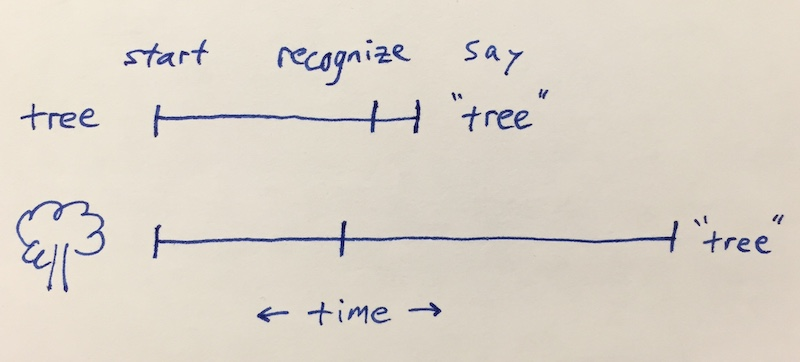

# Cattell didn't say we process words faster than pictures

[James Cattell][] wrote: "experiments I have made show that we can
recognise a single colour or picture in a slightly shorter time than a
word or letter, but take longer to name it."

[James Cattell]: https://en.wikipedia.org/wiki/James_McKeen_Cattell

This is consistent with words being distinct from the concepts they
represent.

---

Reading the excellent
[How a flawed idea is teaching millions of kids to be poor readers][],
I was struck by this interesting claim:

[How a flawed idea is teaching millions of kids to be poor readers]: https://www.northernpublicradio.org/post/how-flawed-idea-teaching-millions-kids-be-poor-readers

> "If you're a skilled reader, your brain has gotten so good at
> reading words that you process the word "chair" faster than you
> process a picture of a chair."

That sentence points to footnote 34:

> "This was established in the late 19th century by a researcher named
> James Cattell who compared reaction times to words and images using
> a newly developed timing mechanism that could measure reactions to
> within 1/1,000th of a second. See [this book][], p. 30."

[this book]: https://www.wiley.com/en-us/Essentials+of+Assessing%2C+Preventing%2C+and+Overcoming+Reading+Difficulties+-p-9781118845240

That book is
[Essentials of Assessing, Preventing, and Overcoming Reading Difficulties][],
and the relevant paragraph on page 30 is:

[Essentials of Assessing, Preventing, and Overcoming Reading Difficulties]: https://www.wiley.com/en-us/-p-9781118845240

> "James Cattell published a paper in 1886 demonstrating a newly
> developed timing mechanism that could measure reaction times to
> within 1 millisecond (i.e., 1/1,000th of a second). With this level
> of precision, he discovered that the reaction times for reading
> printed words like _chair_ or _tree_ were faster than reaction times
> for naming a chair or a tree when shown a picture of those items.
> Thus, over 125 years ago, there was evidence that naming objects and
> naming written words were not the same skills, contrary to our
> intuitions."

That 1886 paper is [The Time it Takes to See and Name Objects][]. The
paper is under three pages long. It doesn't convince me that Cattell
had millisecond precision in his measurements, and it's not
principally about comparing words and images. There's one relevant
paragraph:

[The Time it Takes to See and Name Objects]: https://academic.oup.com/mind/article-abstract/os-XI/41/63/2888375

> "The time required to see and name colours and pictures of objects
> was determined in the same way. The time was found to be about the
> same (over ½sec.) for colours as for pictures, and about twice as
> long as for words and letters. Other experiments I have made show
> that we can recognise a single colour or picture in a slightly
> shorter time than a word or letter, but take longer to name it. This
> is because in the case of words and letters the association between
> the idea and name has taken place so often that the process has
> become automatic, whereas in the case of colours and pictures we
> must by a voluntary effort choose the name. Such experiments would
> be useful in investigating aphasia."

It isn't explained in the paper, but I have to imagine he measured
recognition as distinct from naming via some mechanism like tapping
when you see a picture of a tree, for example.

So the consistency of the quotes above with the Cattell source depends
on what it means "to process." If it means "to name," then it's
consistent. But if it means "to recognize," which I think is more
natural, then it doesn't convey the result Cattell published.

I think this is all fascinating; I'd love to learn about more recent
research on this topic.
