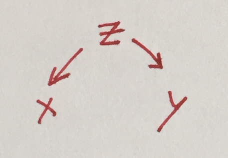

# Correlation can be confounder determination

In a situation of pure confounding (_x_←_z_→_y_) with equivariant
noise, the [correlation][] between _x_ and _y_ is the
[coefficient of determination][] between _z_ and either _x_ or _y_:
\\( r = R^2 \\).

[correlation]: https://en.wikipedia.org/wiki/Pearson_correlation_coefficient
[coefficient of determination]: https://en.wikipedia.org/wiki/Coefficient_of_determination

I got to thinking about this because of [The Book of Why][]:

> "[[Burks][]] computed the direct effect of parental IQ on children's
> IQ and found that only 35 percent, or about one-third, of IQ
> variation is inherited. In other words, parents with an IQ fifteen
> points above average would typically have children five points above
> average." (page 306)

[The Book of Why]: /20200917-book_of_why/
[Burks]: https://en.wikipedia.org/wiki/Barbara_Stoddard_Burks

That works out if we have a simple data-generating model like this in
[R][]:

[R]: https://www.r-project.org/

<!-- set.seed(10)  -->

```r
z <- rnorm(1000000, sd=1)            # genetics,            variance=1
x <- z + rnorm(1000000, sd=sqrt(2))  # IQ of parents,  adds variance=2 noise
y <- z + rnorm(1000000, sd=sqrt(2))  # IQ of children, adds variance=2 noise
mean(y[0.9 < x & x < 1.1])
## [1] 0.334556
```

One third of _x_ and _y_ variance is due to _z_, and when _x_ values
are around 1, average corresponding _y_ value is around 1/3, so that
checks out: regression to the mean.

The genetic contribution _z_ isn't really observable, though. All we
see are _x_ and _y_. So how do we get the contribution of _z_?

Both _x_ and _y_ [have][] variance 3. If we had a twin study in this
world, we could recover that variance is 2 when genetics is fixed, and
that would let us find that genetics explains 1/3 of variance. But we
don't generally have a twin study.

[have]: /20201030-the_variance_sum_law_is_interesting/

The common thing to do would be a regression.

```r
summary(lm(y ~ x))  # (Pulling out one line of output...)
## Multiple R-squared:  0.1114,     Adjusted R-squared:  0.1114
```

This is usually interpreted as saying that _x_ explains 11% of the
variation of _y_. That's true enough, but it isn't how much is
explained by _z_.

The correlation between _x_ and _y_, however, _is_ how much variance
is explained by _z_.

```r
cor(x, y)
## [1] 0.3338363
```

More generally (for non-equivariant noise) the regression coefficient
gives the fraction of variance explained by _z_. (See also the earlier
estimate illustrating regression to the mean.)

So this is a way of estimating the effect of an unobserved confounder,
which seems to work in this very simple setting. Is this like what
Burks did? Probably her models were not so simple. Is this a special
case of some more general approach?

I don't think I've seen this kind of "method" before; I'd love to see
more elaboration of this kind of idea for estimating impacts of
unobserved variables.



The data-generating model above (and surrounding discussion) requires
suspension of disbelief; it represents some sort of asexual
reproduction, has additional influences on IQ that are entirely
uncorrelated between parents and children, and of course IQ is fraught
as a topic to begin with. Hopefully the statistical considerations are
still visible.
